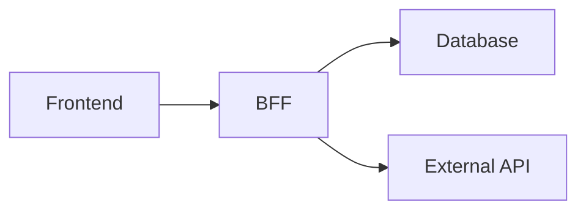

# 汎用ガードレールフレームワーク v1.0

**目的**: あらゆるプロジェクトで使える、AI開発における失敗を防ぐためのフレームワーク

**更新日**: 2025-10-14

---

## 📋 目次

1. [ガードレールが機能しなかった3つの理由](#1-ガードレールが機能しなかった3つの理由)
2. [汎用ガードレールの3層防御](#2-汎用ガードレールの3層防御)
3. [Layer 1: 事前防御（Before）](#3-layer-1-事前防御before)
4. [Layer 2: 実行中防御（During）](#4-layer-2-実行中防御during)
5. [Layer 3: 事後防御（After）](#5-layer-3-事後防御after)
6. [実装テンプレート](#6-実装テンプレート)
7. [適用例](#7-適用例)

---

## 1. ガードレールが機能しなかった3つの理由

### 理由1: **参照するタイミングがない**

```
問題: ガードレールは存在するが、誰も読まない
理由: 「いつ読むべきか」が明確でない
```

**事例**:
- データ整合性のガードレール: 存在していたが、実装時に参照しなかった
- テストデータ操作の標準化: 存在していたが、Supabase Auth UIで直接操作してしまった

**対策**: 
→ **Layer 1: 事前防御** で解決（後述）

---

### 理由2: **人間の記憶に依存している**

```
問題: 「ガードレールを確認する」こと自体を忘れる
理由: チェックリストが頭の中にしかない
```

**事例**:
- middleware.ts の重複チェック: 存在を知らなかった
- Supabaseスキーマ公開設定: 確認手順がなかった

**対策**: 
→ **Layer 2: 実行中防御** で解決（後述）

---

### 理由3: **検証が手動で属人的**

```
問題: 設定が正しいかどうかを手動で確認している
理由: 自動検証スクリプトがない
```

**事例**:
- `pgrst.db_schemas` の設定確認: 手動SQLで確認
- `user_org_roles` の外部キー確認: 手動SQLで確認

**対策**: 
→ **Layer 3: 事後防御** で解決（後述）

---

## 2. 汎用ガードレールの3層防御

### 全体像

```
┌─────────────────────────────────────────────────┐
│ Layer 1: 事前防御（Before）                      │
│ - タスク開始時に関連ガードレールを強制表示        │
│ - 設計ドキュメント必須化                         │
│ - Pre-implementation Review                     │
└─────────────────────────────────────────────────┘
                    ↓
┌─────────────────────────────────────────────────┐
│ Layer 2: 実行中防御（During）                    │
│ - リアルタイムチェック（IDEプラグイン）           │
│ - AI Copilotへのガードレール埋め込み             │
│ - 実装中の自動警告                               │
└─────────────────────────────────────────────────┘
                    ↓
┌─────────────────────────────────────────────────┐
│ Layer 3: 事後防御（After）                       │
│ - Pre-commit自動検証                            │
│ - CI/CD自動チェック                             │
│ - 設定ドリフト検知                               │
└─────────────────────────────────────────────────┘
```

---

## 3. Layer 1: 事前防御（Before）

### 原則: **「コードを書く前に考える」を強制する**

---

### 3.1 タスク開始時チェックリスト自動表示

#### 概要
タスクを開始する際、関連するガードレールを**自動的に表示**し、確認を強制する。

#### 実装方法

**Step 1: `.github/ISSUE_TEMPLATE/` でテンプレート化**

```yaml
# .github/ISSUE_TEMPLATE/feature.yml
name: 機能追加
description: 新機能を追加する際のテンプレート
body:
  - type: markdown
    attributes:
      value: |
        ## 📋 開始前チェックリスト
        
        以下を **必ず** 確認してください：
        
        - [ ] 関連するガードレールを読みましたか？
          - データベース変更: `docs/guardrails/SCHEMA_CHANGE_GUIDELINES.md`
          - インフラ設定: `docs/guardrails/INFRASTRUCTURE_SETUP_CHECKLIST.md`
          - BFF実装: `docs/guardrails/CURSOR_COMMON_SETTINGS_v3.3_BFF.md`
        
        - [ ] 影響範囲を分析しましたか？
          - `npm run schema:impact` を実行
        
        - [ ] 設計ドキュメントを作成しましたか？
          - `docs/design/` に作成
        
  - type: textarea
    id: design
    attributes:
      label: 設計ドキュメント
      description: 実装前に設計を記述してください（必須）
      placeholder: |
        ## 設計概要
        - 目的:
        - アーキテクチャ:
        - データフロー:
        - 影響範囲:
        - リスク評価:
    validations:
      required: true
```

**Step 2: Cursor Rules / AI Instructions に組み込む**

```markdown
# .cursor/rules/pre-implementation-check.md

## 実装前の必須確認事項

### ⚠️ 重要: コードを書く前に以下を確認してください

1. **関連ガードレールの確認**
   - データベース変更の場合: `docs/guardrails/SCHEMA_CHANGE_GUIDELINES.md`
   - インフラ設定の場合: `docs/guardrails/INFRASTRUCTURE_SETUP_CHECKLIST.md`
   - BFF実装の場合: `docs/guardrails/CURSOR_COMMON_SETTINGS_v3.3_BFF.md`

2. **影響範囲分析**
   - `npm run schema:impact` を実行
   - リスクレベルを確認

3. **設計ドキュメント作成**
   - `docs/design/YYYY-MM-DD_<feature-name>.md` を作成
   - 以下を含める:
     - 目的
     - アーキテクチャ図
     - データフロー
     - 影響範囲
     - リスク評価

### AIアシスタントへの指示

**実装を依頼された場合、以下の順序で進めてください:**

1. **STOP: まず関連ガードレールを読む**
   - `docs/guardrails/` 配下を確認
   - 関連する制約を列挙

2. **設計フェーズ**
   - ユーザーに設計案を提示
   - リスクを明示
   - ガードレール遵守を確認

3. **実装フェーズ**
   - 設計が承認されてから実装開始
   - 実装中も定期的にガードレールを参照

4. **検証フェーズ**
   - 自動検証スクリプトを実行
   - チェックリストを確認
```

---

### 3.2 設計ドキュメント必須化

#### 概要
**「いきなりコードを書かない」** を徹底するため、設計ドキュメントを必須化する。

#### テンプレート

```markdown
# 設計ドキュメント: <機能名>

**日付**: YYYY-MM-DD  
**作成者**: <名前>  
**レビュアー**: <名前>  
**ステータス**: Draft / In Review / Approved

---

## 1. 目的

この機能が解決する問題を明確に記述。

---

## 2. アーキテクチャ

### 2.1 システム構成図



### 2.2 データフロー

1. ユーザーがXXXを実行
2. BFFがYYYをチェック
3. データベースにZZZを保存

---

## 3. データモデル

### 3.1 新規テーブル

```sql
CREATE TABLE xxx (
  id UUID PRIMARY KEY,
  ...
);
```

### 3.2 既存テーブルへの変更

- `users` テーブルに `xxx` カラムを追加
- 理由: ...
- 影響範囲: `npm run schema:impact` の結果を添付

---

## 4. API設計

### 4.1 エンドポイント

```
POST /api/xxx
GET /api/xxx/:id
```

### 4.2 リクエスト/レスポンス

```typescript
interface Request {
  ...
}

interface Response {
  ...
}
```

---

## 5. 影響範囲

### 5.1 データベース

- **テーブル**: `users`, `user_org_roles`
- **リスクレベル**: MEDIUM
- **影響箇所**: 3件のAPI、5件のコンポーネント

### 5.2 外部API

- **使用API**: JWNET マニフェスト登録API
- **リトライポリシー**: 指数バックオフ、最大3回

---

## 6. リスク評価

| リスク | 影響度 | 対策 |
|--------|--------|------|
| データ不整合 | HIGH | トランザクション化 |
| API障害 | MEDIUM | リトライ＋DLQ |

---

## 7. ガードレール遵守確認

- [ ] `docs/guardrails/SCHEMA_CHANGE_GUIDELINES.md` を確認
- [ ] `docs/guardrails/INFRASTRUCTURE_SETUP_CHECKLIST.md` を確認
- [ ] `npm run schema:impact` を実行
- [ ] 外部キーが正しく設定されているか確認
- [ ] RLS設定が正しいか確認

---

## 8. テスト計画

- [ ] ユニットテスト
- [ ] 統合テスト
- [ ] E2Eテスト

---

## 9. ロールバック計画

```sql
-- 変更をロールバックするSQL
ALTER TABLE xxx DROP COLUMN yyy;
```

---

## 10. 承認

- [ ] レビュアー承認
- [ ] テックリード承認
```

---

### 3.3 Pre-implementation Review

#### 概要
コードを書く前に、設計をレビューする文化を作る。

#### プロセス

```
1. 設計ドキュメント作成
   ↓
2. Pull Request（設計のみ）
   ↓
3. レビュー＆承認
   ↓
4. 実装開始
```

#### GitHub Actions 例

```yaml
# .github/workflows/design-review.yml
name: Design Review

on:
  pull_request:
    paths:
      - 'docs/design/**'

jobs:
  design-check:
    runs-on: ubuntu-latest
    steps:
      - uses: actions/checkout@v4
      
      - name: Check design document exists
        run: |
          if [ ! -f "docs/design/$(date +%Y-%m-%d)_*.md" ]; then
            echo "❌ 設計ドキュメントが見つかりません"
            exit 1
          fi
      
      - name: Check guardrail compliance
        run: |
          grep -q "ガードレール遵守確認" docs/design/*.md || {
            echo "❌ ガードレール遵守確認セクションがありません"
            exit 1
          }
      
      - name: Request review
        run: |
          echo "✅ 設計ドキュメントが存在します。レビューを依頼してください。"
```

---

## 4. Layer 2: 実行中防御（During）

### 原則: **「実装中に間違いに気づく」を自動化する**

---

### 4.1 AI Copilot へのガードレール埋め込み

#### 概要
AI（Cursor、GitHub Copilot等）のシステムプロンプトにガードレールを埋め込み、実装中に自動的に警告を出す。

#### 実装方法

**Cursor の場合: `.cursorrules` に記述**

```markdown
# .cursorrules

## 重要: ガードレール自動チェック

あなた（AIアシスタント）は、ユーザーから実装を依頼された際、**必ず以下の手順で進めてください**:

### Step 1: ガードレール確認（必須）

**実装を開始する前に**、以下のガードレールを読み、関連する制約を確認してください:

1. データベース変更の場合:
   - `docs/guardrails/SCHEMA_CHANGE_GUIDELINES.md`
   - 確認事項:
     - [ ] 影響範囲分析を実施したか？
     - [ ] DDLは新規番号で作成しているか？
     - [ ] ロールバック手順を記載したか？

2. インフラ設定の場合:
   - `docs/guardrails/INFRASTRUCTURE_SETUP_CHECKLIST.md`
   - 確認事項:
     - [ ] middleware.ts が重複していないか？
     - [ ] Supabaseスキーマが公開されているか？
     - [ ] 権限設定が正しいか？

3. BFF実装の場合:
   - `docs/guardrails/CURSOR_COMMON_SETTINGS_v3.3_BFF.md`
   - 確認事項:
     - [ ] APIキーはサーバーサイドのみで使用しているか？
     - [ ] Prismaトランザクションを使用しているか？
     - [ ] Zodバリデーションを実装しているか？

### Step 2: 設計提示（必須）

ユーザーに対して、以下を含む設計案を提示してください:

```markdown
## 設計案

### アーキテクチャ
- ...

### データフロー
- ...

### 影響範囲
- テーブル: `xxx`, `yyy`
- リスクレベル: MEDIUM
- 影響箇所: 3件のAPI

### ガードレール遵守
- [x] `docs/guardrails/SCHEMA_CHANGE_GUIDELINES.md` 確認済み
- [x] 影響範囲分析実施済み（リスクレベル: MEDIUM）
- [x] ロールバック手順を記載

### リスク
- データ不整合のリスク → トランザクション化で対応

### 承認をお願いします
```

### Step 3: 承認後に実装開始

ユーザーが承認してから実装を開始してください。

### Step 4: 実装中の自動チェック

実装中も、以下を定期的に確認してください:

- [ ] 既存ファイルを直接編集していないか？
- [ ] 型安全性を損なっていないか？
- [ ] エラーハンドリングが適切か？

### 禁止事項

❌ **絶対にやってはいけないこと**:

1. ガードレールを読まずに実装を開始する
2. 設計なしでいきなりコードを書く
3. ユーザーの承認なしで破壊的な変更を行う

✅ **必ずやること**:

1. 関連ガードレールを事前に読む
2. 設計案をユーザーに提示
3. 承認を得てから実装開始
```

---

### 4.2 IDE プラグイン（リアルタイムチェック）

#### 概要
コードを書いている最中に、リアルタイムで警告を表示する。

#### 実装例（ESLintカスタムルール）

```javascript
// eslint-plugin-guardrail/index.js
module.exports = {
  rules: {
    'no-direct-supabase-auth': {
      meta: {
        type: 'problem',
        docs: {
          description: 'Supabase Auth UIでの直接操作を禁止',
        },
      },
      create(context) {
        return {
          CallExpression(node) {
            if (
              node.callee.property &&
              node.callee.property.name === 'deleteUser' &&
              context.getFilename().includes('src/')
            ) {
              context.report({
                node,
                message: '❌ Supabase Auth UIでの直接操作は禁止です。db/quick_setup.sql を使用してください。',
              });
            }
          },
        };
      },
    },
    'require-schema-impact-analysis': {
      meta: {
        type: 'problem',
        docs: {
          description: 'スキーマ変更時に影響範囲分析を要求',
        },
      },
      create(context) {
        return {
          Program(node) {
            const filename = context.getFilename();
            if (filename.includes('db/ddl/') && filename.endsWith('.sql')) {
              // ファイルの先頭に影響範囲分析結果がコメントされているかチェック
              const sourceCode = context.getSourceCode();
              const comments = sourceCode.getAllComments();
              const hasImpactAnalysis = comments.some(comment =>
                comment.value.includes('影響範囲分析')
              );

              if (!hasImpactAnalysis) {
                context.report({
                  node,
                  message: '❌ DDLファイルには影響範囲分析結果をコメントで記載してください。',
                });
              }
            }
          },
        };
      },
    },
  },
};
```

---

### 4.3 コミット前自動警告

#### 概要
コミット前に、ガードレール違反がないかを自動チェックする。

#### 実装例（Husky + lint-staged）

```javascript
// .husky/pre-commit
#!/usr/bin/env sh
. "$(dirname -- "$0")/_/husky.sh"

echo "🔍 ガードレール遵守チェック..."

# 1. ファイル構造チェック
npm run check:structure

# 2. DDL変更チェック
CHANGED_FILES=$(git diff --cached --name-only)
if echo "$CHANGED_FILES" | grep -q "db/ddl/"; then
  echo "⚠️ DDLファイルの変更を検出しました。"
  echo ""
  echo "📋 必須チェック:"
  echo "  1. 影響範囲分析を実施しましたか？ (npm run schema:impact)"
  echo "  2. ロールバック手順を記載しましたか？"
  echo "  3. 設計ドキュメントを作成しましたか？"
  echo ""
  read -p "すべて完了していますか？ (y/n) " -n 1 -r
  echo
  if [[ ! $REPLY =~ ^[Yy]$ ]]; then
    echo "❌ コミットを中止しました。"
    exit 1
  fi
fi

# 3. middleware重複チェック
ROOT_MIDDLEWARE="next-app/middleware.ts"
SRC_MIDDLEWARE="next-app/src/middleware.ts"

if [ -f "$ROOT_MIDDLEWARE" ] && [ -f "$SRC_MIDDLEWARE" ]; then
  echo "❌ エラー: middleware.ts が重複しています"
  echo "   - next-app/middleware.ts"
  echo "   - next-app/src/middleware.ts"
  echo "   → next-app/src/middleware.ts を削除してください"
  exit 1
fi

echo "✅ ガードレールチェック完了"

npx lint-staged
```

---

## 5. Layer 3: 事後防御（After）

### 原則: **「設定が正しいかを自動検証する」**

---

### 5.1 設定ドリフト検知

#### 概要
インフラ設定が期待値と異なる状態（ドリフト）を自動的に検知する。

#### 実装例

```typescript
// scripts/check-infrastructure.ts
import { createClient } from '@supabase/supabase-js';

interface ConfigCheck {
  name: string;
  status: 'OK' | 'ERROR';
  message: string;
}

async function checkInfrastructure(): Promise<ConfigCheck[]> {
  const checks: ConfigCheck[] = [];

  // 1. Supabaseスキーマ公開設定チェック
  try {
    const { data, error } = await supabase.rpc('current_setting', {
      setting_name: 'pgrst.db_schemas'
    });

    if (error || !data.includes('app')) {
      checks.push({
        name: 'Supabase Schema Exposure',
        status: 'ERROR',
        message: `pgrst.db_schemas が 'public, app' に設定されていません。現在: ${data}`
      });
    } else {
      checks.push({
        name: 'Supabase Schema Exposure',
        status: 'OK',
        message: 'pgrst.db_schemas は正しく設定されています'
      });
    }
  } catch (error) {
    checks.push({
      name: 'Supabase Schema Exposure',
      status: 'ERROR',
      message: `チェック失敗: ${error.message}`
    });
  }

  // 2. スキーマ権限チェック
  try {
    const { data, error } = await supabase.rpc('check_schema_permissions', {
      schema_name: 'app',
      role_name: 'anon'
    });

    if (error || !data) {
      checks.push({
        name: 'Schema Permissions (anon)',
        status: 'ERROR',
        message: 'anon ロールに app スキーマへの権限がありません'
      });
    } else {
      checks.push({
        name: 'Schema Permissions (anon)',
        status: 'OK',
        message: 'anon ロールの権限は正しく設定されています'
      });
    }
  } catch (error) {
    checks.push({
      name: 'Schema Permissions (anon)',
      status: 'ERROR',
      message: `チェック失敗: ${error.message}`
    });
  }

  // 3. 外部キー整合性チェック
  try {
    const { data, error } = await supabase.rpc('check_foreign_keys');

    if (error || data.some(fk => fk.status === 'INVALID')) {
      checks.push({
        name: 'Foreign Key Integrity',
        status: 'ERROR',
        message: '外部キー制約に問題があります'
      });
    } else {
      checks.push({
        name: 'Foreign Key Integrity',
        status: 'OK',
        message: 'すべての外部キーは正しく設定されています'
      });
    }
  } catch (error) {
    checks.push({
      name: 'Foreign Key Integrity',
      status: 'ERROR',
      message: `チェック失敗: ${error.message}`
    });
  }

  // 4. middleware重複チェック
  const fs = require('fs');
  const rootMiddleware = 'next-app/middleware.ts';
  const srcMiddleware = 'next-app/src/middleware.ts';

  if (fs.existsSync(rootMiddleware) && fs.existsSync(srcMiddleware)) {
    checks.push({
      name: 'Middleware Duplication',
      status: 'ERROR',
      message: 'middleware.ts が重複しています'
    });
  } else if (!fs.existsSync(rootMiddleware) && !fs.existsSync(srcMiddleware)) {
    checks.push({
      name: 'Middleware Existence',
      status: 'ERROR',
      message: 'middleware.ts が存在しません'
    });
  } else {
    checks.push({
      name: 'Middleware',
      status: 'OK',
      message: 'middleware.ts は正しく配置されています'
    });
  }

  return checks;
}

// 実行
checkInfrastructure().then(checks => {
  console.log('\n📊 インフラストラクチャ検証結果\n');
  
  checks.forEach(check => {
    const icon = check.status === 'OK' ? '✅' : '❌';
    console.log(`${icon} ${check.name}: ${check.message}`);
  });

  const hasErrors = checks.some(c => c.status === 'ERROR');
  
  if (hasErrors) {
    console.log('\n❌ エラーが検出されました。');
    process.exit(1);
  } else {
    console.log('\n✅ すべてのチェックに合格しました。');
  }
});
```

**package.json に追加**:

```json
{
  "scripts": {
    "check:infra": "ts-node scripts/check-infrastructure.ts",
    "preflight": "npm run check:structure && npm run check:infra && npm run typecheck"
  }
}
```

---

### 5.2 CI/CD自動検証

#### GitHub Actions例

```yaml
# .github/workflows/guardrail-check.yml
name: Guardrail Compliance Check

on:
  pull_request:
    branches: [main, develop]
  push:
    branches: [main]

jobs:
  infrastructure-check:
    runs-on: ubuntu-latest
    steps:
      - uses: actions/checkout@v4
      
      - uses: actions/setup-node@v4
        with:
          node-version: '20'
      
      - name: Install dependencies
        run: npm ci
      
      - name: Check project structure
        run: npm run check:structure
      
      - name: Check infrastructure configuration
        run: npm run check:infra
        env:
          SUPABASE_URL: ${{ secrets.SUPABASE_URL }}
          SUPABASE_ANON_KEY: ${{ secrets.SUPABASE_ANON_KEY }}
      
      - name: Verify guardrail compliance
        run: |
          # DDL変更があるかチェック
          if git diff --name-only origin/main...HEAD | grep -q "db/ddl/"; then
            echo "DDL変更を検出しました。影響範囲分析を確認します..."
            
            # 設計ドキュメントが存在するかチェック
            if [ ! -f "docs/design/$(date +%Y-%m-%d)_*.md" ]; then
              echo "❌ エラー: 設計ドキュメントが見つかりません"
              exit 1
            fi
            
            echo "✅ 設計ドキュメントが存在します"
          fi

  schema-validation:
    runs-on: ubuntu-latest
    steps:
      - uses: actions/checkout@v4
      
      - name: Validate database schema
        run: |
          # スキーマバリデーションスクリプトを実行
          npm run db:validate
```

---

### 5.3 定期的な自動検証

#### 概要
毎日、設定が正しいかを自動的に検証し、Slackに通知する。

#### GitHub Actions（Cron）

```yaml
# .github/workflows/daily-infrastructure-check.yml
name: Daily Infrastructure Health Check

on:
  schedule:
    # 毎日午前9時（JST）に実行
    - cron: '0 0 * * *'
  workflow_dispatch:

jobs:
  health-check:
    runs-on: ubuntu-latest
    steps:
      - uses: actions/checkout@v4
      
      - uses: actions/setup-node@v4
        with:
          node-version: '20'
      
      - name: Install dependencies
        run: npm ci
      
      - name: Run infrastructure health check
        id: check
        run: |
          npm run check:infra > check-results.txt 2>&1 || true
          cat check-results.txt
      
      - name: Notify Slack on failure
        if: failure()
        uses: slackapi/slack-github-action@v1
        with:
          webhook-url: ${{ secrets.SLACK_WEBHOOK_URL }}
          payload: |
            {
              "text": "❌ インフラストラクチャヘルスチェックに失敗しました",
              "blocks": [
                {
                  "type": "section",
                  "text": {
                    "type": "mrkdwn",
                    "text": "*インフラストラクチャヘルスチェック失敗*\n\n詳細は GitHub Actions を確認してください。"
                  }
                }
              ]
            }
```

---

## 6. 実装テンプレート

### 6.1 新規プロジェクトセットアップ

```bash
# 1. ガードレールフレームワークをコピー
cp -r docs/guardrails/ <new-project>/docs/guardrails/

# 2. 自動チェックスクリプトをセットアップ
npm install --save-dev husky lint-staged
npx husky init
cp .husky/pre-commit.example .husky/pre-commit

# 3. GitHub Actions をセットアップ
cp .github/workflows/guardrail-check.yml <new-project>/.github/workflows/

# 4. Cursor Rules を設定
cp .cursorrules <new-project>/.cursorrules

# 5. 初回検証を実行
npm run check:structure
npm run check:infra
```

---

### 6.2 既存プロジェクトへの適用

```bash
# Phase 1: ドキュメント整備（Week 1）
1. docs/guardrails/ にガードレールをコピー
2. README にガードレールへのリンクを追加

# Phase 2: 自動チェック導入（Week 2）
1. check:structure スクリプトを追加
2. check:infra スクリプトを追加
3. pre-commit フックを追加

# Phase 3: CI/CD統合（Week 3）
1. GitHub Actions を追加
2. Slack通知を設定

# Phase 4: 運用開始（Week 4）
1. チームに周知
2. 1週間のトライアル期間
3. フィードバック収集・改善
```

---

## 7. 適用例

### 例1: データベーススキーマ変更

#### Before（ガードレールなし）

```
開発者: "users テーブルに email カラムを追加して"
AI: "わかりました！" → いきなり実装
→ 結果: 既存データとの不整合、外部キー制約違反
```

#### After（ガードレールあり）

```
開発者: "users テーブルに email カラムを追加して"

AI: 
"承知しました。まず関連ガードレールを確認します。

📋 ガードレール確認:
- docs/guardrails/SCHEMA_CHANGE_GUIDELINES.md を確認
- 影響範囲分析が必要です

🔍 影響範囲分析を実施します...
$ npm run schema:impact -- --table users --column email

結果:
- リスクレベル: MEDIUM
- 影響箇所: 5件のAPI、8件のコンポーネント

📝 設計案:

## 設計概要
- 目的: ユーザーのメールアドレスを app.users テーブルで管理
- アーキテクチャ: auth.users.email と同期
- データフロー: auth.users → app.users (トリガー)
- 影響範囲: 5 APIs, 8 Components
- リスク評価: MEDIUM

## 実装方針
1. DDL新規作成: db/ddl/024_add_email_to_users.sql
2. UNIQUE制約を追加
3. auth.users との同期トリガーを作成
4. 既存データの移行スクリプト

## ガードレール遵守
- [x] SCHEMA_CHANGE_GUIDELINES.md 確認済み
- [x] 影響範囲分析実施済み（MEDIUM）
- [x] ロールバック手順を記載
- [x] 外部キー制約を確認

この設計で問題ないでしょうか？承認いただけましたら実装を開始します。"
```

---

### 例2: 外部API統合

#### Before（ガードレールなし）

```
開発者: "JWNET APIを統合して"
AI: "わかりました！" → フロントエンドにAPIキーを書いてしまう
→ 結果: セキュリティリスク
```

#### After（ガードレールあり）

```
開発者: "JWNET APIを統合して"

AI:
"承知しました。まず関連ガードレールを確認します。

📋 ガードレール確認:
- docs/guardrails/CURSOR_COMMON_SETTINGS_v3.3_BFF.md を確認
- 外部API統合はBFF層で実装必須

⚠️ 重要な制約:
- APIキーはサーバーサイドのみで管理
- フロントエンドには公開しない
- リトライポリシー必須

📝 設計案:

## アーキテクチャ
- BFF層で JWNET クライアントを実装
- 環境変数で認証情報を管理
- Zod でレスポンスバリデーション

## セキュリティ
- APIキー: process.env.JWNET_API_KEY（サーバーサイドのみ）
- フロントエンド: /api/jwnet/* を呼び出すのみ

## エラーハンドリング
- リトライ: 指数バックオフ、最大3回
- DLQ: 失敗したリクエストをキューに保存

この設計で問題ないでしょうか？"
```

---

## 8. まとめ

### 汎用ガードレールの3層防御

| Layer | タイミング | 手法 | 効果 |
|-------|----------|------|------|
| **Layer 1: 事前防御** | コード前 | チェックリスト自動表示、設計ドキュメント必須化 | **「考えずに書く」を防ぐ** |
| **Layer 2: 実行中防御** | コード中 | AI埋め込み、IDE警告、コミット前チェック | **「間違いに気づく」を自動化** |
| **Layer 3: 事後防御** | コード後 | 設定検証、CI/CD、定期チェック | **「設定ドリフト」を検知** |

---

### 適用優先順位

#### 🔴 今すぐ実装（1週間以内）
1. `.cursorrules` にガードレール確認プロセスを追加
2. `check:structure` スクリプトを作成
3. Pre-commitフックを設定

#### 🟡 早急に実装（2週間以内）
1. 設計ドキュメントテンプレートを作成
2. `check:infra` スクリプトを作成
3. GitHub Actions を設定

#### 🟢 中期的に実装（1ヶ月以内）
1. ESLintカスタムルールを作成
2. 定期的な自動検証を設定
3. Slack通知を設定

---

### 成功の指標

- [ ] ガードレール違反が **0件/月** になる
- [ ] 設計なしでの実装が **0件/月** になる
- [ ] 設定ドリフトが **0件/月** になる

---

**最終更新**: 2025-10-14  
**バージョン**: 1.0  
**作成者**: AI Assistant

---

## 付録: チェックリスト

### 新規タスク開始時

- [ ] 関連ガードレールを読んだ
- [ ] 影響範囲分析を実施した
- [ ] 設計ドキュメントを作成した
- [ ] レビューを受けた

### 実装中

- [ ] AI が設計案を提示した
- [ ] 承認を得てから実装開始した
- [ ] ガードレールを定期的に参照している

### コミット前

- [ ] `npm run check:structure` を実行した
- [ ] `npm run check:infra` を実行した
- [ ] `npm run typecheck` を実行した
- [ ] テストが通った

### マージ前

- [ ] CI/CDが成功した
- [ ] コードレビューを受けた
- [ ] ドキュメントを更新した

