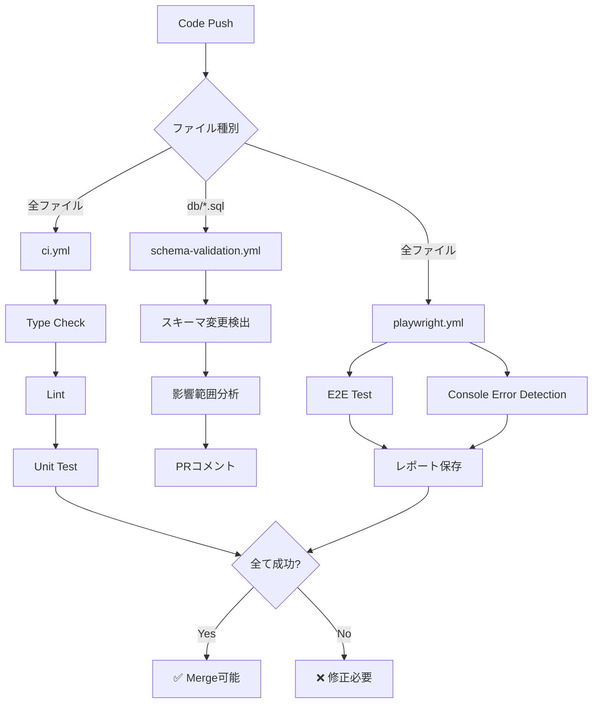

# CI/CD セットアップガイド

## GitHub Actions ワークフロー

### 概要

3つの主要ワークフローが自動実行されます：

| ワークフロー | トリガー | 目的 |
|------------|---------|------|
| `ci.yml` | PR/Push | 型チェック・Lint・テスト |
| `schema-validation.yml` | DBスキーマ変更時 | 影響範囲分析・チェックリスト |
| `playwright.yml` | PR/Push | E2Eテスト・コンソールエラー検知 |

## ワークフロー詳細

### 1. ci.yml - Quality Gate

```yaml
# トリガー
on:
  pull_request:
    branches: [main, develop]
  push:
    branches: [main, develop]
```

**実行内容:**
- ✅ TypeScript型チェック (`pnpm typecheck`)
- ✅ ESLint (`pnpm lint`)
- ✅ ユニットテスト (`pnpm test`)

**成功条件:**
- 型エラーなし
- Lintエラーなし
- テスト全てパス

### 2. schema-validation.yml - Schema Impact

```yaml
# トリガー
on:
  pull_request:
    paths:
      - 'db/**/*.sql'
      - 'prisma/**'
```

**実行内容:**
- 📊 スキーマ変更ファイル検出
- 📊 主要テーブルの影響範囲分析
- 💬 PRにチェックリストコメント

**PRコメント例:**
```markdown
## ⚠️ スキーマ変更を検出しました

**必須チェックリスト:**
- [ ] `pnpm schema:impact` で影響範囲を分析
- [ ] `pnpm typecheck` で型エラー確認
- [ ] `pnpm seed:all` でテストデータ更新
- [ ] `pnpm test:e2e` でE2Eテスト実行
```

### 3. playwright.yml - E2E Tests

```yaml
# トリガー
on:
  pull_request:
    branches: [main, develop]
```

**実行内容:**
- 🎭 E2Eテスト実行
- 🔍 コンソールエラー検知
- 📸 失敗時スクリーンショット保存

**テストレポート:**
- `playwright-report/` - HTMLレポート
- `test-results/` - スクリーンショット・トレース

## セットアップ手順

### 1. GitHub Secrets設定

```bash
# GitHub Repository Settings → Secrets → Actions

# 必須Secrets
DATABASE_URL=postgresql://...
SUPABASE_SERVICE_ROLE_KEY=eyJ...

# オプション
JWNET_API_KEY=... (JWNET統合時)
```

### 2. ブランチ保護ルール

```bash
# Settings → Branches → Add rule

Branch name pattern: main

✅ Require pull request before merging
✅ Require status checks to pass before merging
  - Quality Gate / quality-gate
  - E2E Tests / test-e2e
  - Console Error Detection / console-errors
```

### 3. ワークフロー確認

```bash
# ローカルで動作確認
pnpm typecheck
pnpm lint
pnpm test
pnpm test:e2e

# 全て成功すればCIもパスする
```

## トラブルシューティング

### ワークフローが失敗する

#### 型エラー

```bash
# ローカルで確認
pnpm typecheck

# エラー修正後
git add .
git commit -m "fix: type errors"
```

#### Lintエラー

```bash
# 自動修正
pnpm lint --fix
pnpm format

# コミット
git add .
git commit -m "style: lint fixes"
```

#### E2Eテスト失敗

```bash
# ローカルで再現
pnpm test:e2e

# UIモードでデバッグ
pnpm playwright test --ui

# 失敗したテストのみ再実行
pnpm playwright test --last-failed
```

### スキーマ検証が実行されない

**原因**: `db/` 配下のファイルが変更されていない

**確認**:
```bash
git diff origin/main...HEAD --name-only | grep db/
```

### PRコメントが投稿されない

**原因**: GitHub Token権限不足

**対策**:
1. Repository Settings → Actions → General
2. Workflow permissions → "Read and write permissions"
3. 保存

## ベストプラクティス

### 1. 小さなPRを心がける

```bash
# ❌ 悪い例: 大量の変更
- 10ファイル変更
- スキーマ変更 + 機能追加 + リファクタ

# ✅ 良い例: 目的別に分割
PR #1: スキーマ変更のみ
PR #2: 機能追加のみ
PR #3: リファクタのみ
```

### 2. コミット前に必ずチェック

```bash
# Pre-commitフックが自動実行されるが、
# 手動でも確認すること
pnpm typecheck
pnpm lint
pnpm test
```

### 3. スキーマ変更は慎重に

```bash
# 影響範囲を事前確認
pnpm schema:impact -- --table <table_name>

# リスクレベルがHIGH以上なら相談
```

## CI/CD フロー図



## 次のステップ

1. ✅ GitHub Actions設定完了
2. ⏭️ ブランチ保護ルール設定
3. ⏭️ チームメンバーへ周知
4. ⏭️ 最初のPRで動作確認

## 関連ドキュメント

- [setup-husky.md](./setup-husky.md) - Pre-commitフック
- [seed-data.md](./seed-data.md) - テストデータ管理
- [env-setup.md](./env-setup.md) - 環境変数設定

