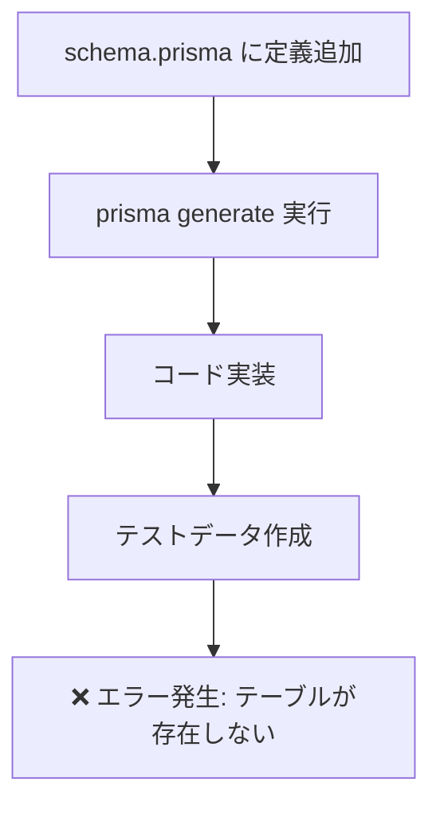
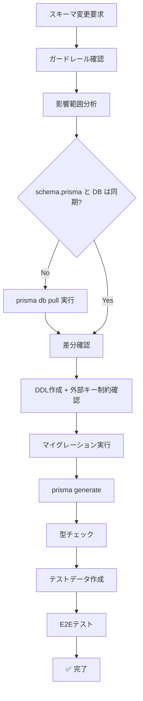

# Post-Mortem: collectors テーブル不整合問題

**作成日**: 2025-10-16  
**重要度**: 🔴 CRITICAL  
**カテゴリ**: データベーススキーマ整合性

---

## 📊 問題のサマリー

### 発生した問題
- `waste_type_masters.collector_id` に外部キー制約がなく、孤立レコードが発生
- `collectors` テーブルが `schema.prisma` に定義されているが、実際のDBには存在しない
- schema.prisma と実際のデータベースの乖離により、テストデータ作成時にエラーが発生

### 影響範囲
- テストデータ作成の失敗
- データ整合性の欠如（孤立レコード11件）
- 型安全性の喪失（Prisma Clientが正しく動作しない）

### 修正にかかった時間
- **検証**: 約2時間（スキーマ確認、孤立レコード検出）
- **実装**: 約1時間（DDL作成、マイグレーション実行）
- **テスト**: 約30分（シードデータ作成、E2E確認）
- **合計**: 約3.5時間

---

## 🔍 根本原因の5段階分析（5 Whys）

### Why 1: なぜ `collectors` テーブルが存在しなかったのか？
**回答**: DDL を実行していなかったため。

### Why 2: なぜDDLを実行していなかったのか？
**回答**: `schema.prisma` に定義を追加しただけで、実際のDBへの反映（マイグレーション）を実行していなかったため。

### Why 3: なぜマイグレーションを実行しなかったのか？
**回答**: 
- Prisma マイグレーション（`prisma migrate dev`）と手動SQL（`db/migrations/*.sql`）の2つの管理方法が混在していた
- どちらを使うべきか明確なルールがなかった
- schema.prisma と DB の同期チェック機構がなかった

### Why 4: なぜ schema.prisma と DB の乖離が検知されなかったのか？
**回答**: 
- CI/CD でのスキーマ整合性チェックがなかった
- `prisma db pull` を定期的に実行していなかった
- 開発開始時のプリフライトチェックに「スキーマ同期確認」が含まれていなかった

### Why 5: なぜ外部キー制約がなかったのか？
**回答**: 
- テーブル作成時に外部キー制約を追加するルールが徹底されていなかった
- スキーマ変更ガイドラインに「外部キー制約の必須チェック」が明記されていなかった
- 影響範囲分析で外部キー制約の有無を確認するステップがなかった

---

## 🚨 本来あるべき開発フロー vs 実際のフロー

### ❌ 実際のフロー（問題あり）



**問題点**:
1. DB への反映（マイグレーション）がスキップされている
2. schema.prisma と DB の整合性確認がない
3. 外部キー制約の確認がない

---

### ✅ 本来あるべきフロー（改善後）



**改善点**:
1. **スキーマ同期チェック** が必須化
2. **外部キー制約確認** がDDL作成時に必須
3. **段階的検証** が各ステップで実施される

---

## 📋 再発防止策（具体的なアクション）

### A. 即時対応（今すぐ実施）

#### 1. Prisma スキーマ同期チェックスクリプト作成
```typescript
// scripts/check-schema-sync.ts
import { execSync } from 'child_process'
import { readFileSync } from 'fs'

async function main() {
  console.log('🔍 Prisma スキーマ同期チェック開始...')
  
  // 1. schema.prisma をバックアップ
  const originalSchema = readFileSync('prisma/schema.prisma', 'utf-8')
  execSync('cp prisma/schema.prisma prisma/schema.prisma.backup')
  
  // 2. DB から最新スキーマを取得
  console.log('📥 DBから最新スキーマを取得中...')
  execSync('pnpm prisma db pull', { stdio: 'inherit' })
  
  // 3. 差分確認
  const newSchema = readFileSync('prisma/schema.prisma', 'utf-8')
  if (originalSchema !== newSchema) {
    console.error('❌ schema.prisma と DB が乖離しています！')
    console.error('   差分を確認してください:')
    execSync('git diff prisma/schema.prisma', { stdio: 'inherit' })
    process.exit(1)
  }
  
  console.log('✅ schema.prisma と DB は同期しています')
}

main()
```

#### 2. 外部キー制約チェックスクリプト作成
```typescript
// scripts/check-foreign-keys.ts
import { PrismaClient } from '@prisma/client'

const prisma = new PrismaClient()

async function main() {
  console.log('🔍 外部キー制約チェック開始...')
  
  // app スキーマの全テーブルを取得
  const tables = await prisma.$queryRaw<{ table_name: string }[]>`
    SELECT table_name
    FROM information_schema.tables
    WHERE table_schema = 'app'
      AND table_type = 'BASE TABLE'
  `
  
  for (const { table_name } of tables) {
    // 外部キー候補（*_id カラム）を取得
    const fkCandidates = await prisma.$queryRaw<{ column_name: string }[]>`
      SELECT column_name
      FROM information_schema.columns
      WHERE table_schema = 'app'
        AND table_name = ${table_name}
        AND column_name LIKE '%_id'
        AND column_name NOT IN ('id', 'org_id', 'created_by', 'updated_by')
    `
    
    for (const { column_name } of fkCandidates) {
      // 外部キー制約が存在するか確認
      const fkConstraint = await prisma.$queryRaw<any[]>`
        SELECT constraint_name
        FROM information_schema.table_constraints
        WHERE table_schema = 'app'
          AND table_name = ${table_name}
          AND constraint_type = 'FOREIGN KEY'
          AND constraint_name LIKE '%${column_name}%'
      `
      
      if (fkConstraint.length === 0) {
        console.warn(`⚠️  ${table_name}.${column_name} に外部キー制約がありません`)
      }
    }
  }
  
  console.log('✅ 外部キー制約チェック完了')
}

main()
```

---

### B. 短期対応（1週間以内）

#### 1. CI/CD にスキーマ整合性チェックを追加
```yaml
# .github/workflows/ci.yml
name: CI

on: [push, pull_request]

jobs:
  schema-check:
    runs-on: ubuntu-latest
    steps:
      - uses: actions/checkout@v3
      - name: Setup Node.js
        uses: actions/setup-node@v3
      - name: Install dependencies
        run: pnpm install
      - name: Check schema sync
        run: pnpm check:schema-sync
      - name: Check foreign keys
        run: pnpm check:foreign-keys
```

#### 2. package.json にコマンド追加
```json
{
  "scripts": {
    "check:schema-sync": "tsx scripts/check-schema-sync.ts",
    "check:foreign-keys": "tsx scripts/check-foreign-keys.ts",
    "preflight": "pnpm check:schema-sync && pnpm check:foreign-keys && pnpm typecheck"
  }
}
```

---

### C. 中期対応（1ヶ月以内）

#### 1. マイグレーション戦略の統一

**結論**: Prisma Migrate を標準採用し、手動SQLは廃止

**理由**:
- 型安全性が保証される
- schema.prisma と DB が自動同期される
- マイグレーション履歴が管理される
- ロールバックが容易

**移行手順**:
```bash
# 1. 既存の手動SQLをPrismaマイグレーションに変換
pnpm prisma migrate diff \
  --from-schema-datasource prisma/schema.prisma \
  --to-schema-datamodel prisma/schema.prisma \
  --script > prisma/migrations/migration.sql

# 2. Prismaマイグレーション履歴を初期化
pnpm prisma migrate resolve --applied "migration_name"

# 3. 以降はPrisma Migrateを使用
pnpm prisma migrate dev --name add_new_feature
```

#### 2. スキーマ変更ワークフローの標準化

**新しい標準ワークフロー**:
```bash
# Step 1: ガードレール確認
cat docs/guardrails/SCHEMA_CHANGE_GUIDELINES.md

# Step 2: スキーマ同期確認
pnpm check:schema-sync

# Step 3: schema.prisma 編集
# （リレーション、フィールド追加）

# Step 4: マイグレーション作成
pnpm prisma migrate dev --name descriptive_name

# Step 5: 外部キー制約確認
pnpm check:foreign-keys

# Step 6: 型生成
pnpm prisma:generate

# Step 7: 型チェック
pnpm typecheck

# Step 8: テストデータ作成
pnpm prisma:seed

# Step 9: E2Eテスト
pnpm test:e2e
```

---

## 📚 今回の問題から得られた知見

### 知見1: Prisma は ORM 以上にスキーマ管理ツールである
- schema.prisma を「DB設計の単一信頼源（Single Source of Truth）」として扱うべき
- 手動SQLとの併用は整合性リスクを生む
- Prisma Migrate を使えば schema.prisma ↔ DB の自動同期が保証される

### 知見2: 外部キー制約は「ドキュメント」である
- 外部キー制約がないと、テーブル間の関係が暗黙的になる
- 新規参画者がスキーマを理解しにくい
- データ整合性エラーが発生しても原因特定が困難

### 知見3: プリフライトチェックの重要性
- 実装開始前のチェックリストが不足していた
- 「スキーマ同期確認」「外部キー制約確認」を必須化すべき
- 自動化できる検証は全て自動化すべき

### 知見4: CI/CD は「守り」のツールである
- ローカルでのチェック漏れを防ぐ最後の砦
- スキーマ整合性チェックは CI/CD で必須化すべき
- デプロイ前に異常を検知できる仕組みが必要

---

## 🎯 グローバルルールへの提案

以下の内容を `.cursor/rules/global-rules.md` に追加することを推奨します：

### 1. Prisma 必須ルールセクション
```markdown
## 🗄️ Prisma 必須ルール（CRITICAL）

### A. スキーマ同期の絶対原則
**実装前に必ず実行**:
```bash
# schema.prisma と DB の同期確認
pnpm check:schema-sync
```

**ルール**:
- [ ] `prisma db pull` を定期的に実行（週1回推奨）
- [ ] schema.prisma 編集後は必ず `prisma migrate dev` 実行
- [ ] 手動SQLとの併用は禁止（Prisma Migrate に統一）

### B. 外部キー制約の必須化
**新しいテーブル/カラム追加時**:
- [ ] `*_id` カラムには必ず外部キー制約を追加
- [ ] `ON DELETE` / `ON UPDATE` の動作を明示
- [ ] schema.prisma で `@relation` を必ず定義

**チェックコマンド**:
```bash
pnpm check:foreign-keys
```

### C. マイグレーション戦略
**Prisma Migrate を標準採用**:
```bash
# ❌ 禁止: 手動SQLでのテーブル作成
psql $DATABASE_URL -f db/migrations/001_create_table.sql

# ✅ 正解: Prisma Migrateを使用
pnpm prisma migrate dev --name create_table
```

**例外（Prisma Migrate が使えない場合）**:
- Supabase RLS ポリシー追加
- 複雑なストアドプロシージャ作成
- データ移行（大量UPDATE/DELETE）

上記の場合のみ、手動SQLを許可するが、実行後に必ず `pnpm check:schema-sync` を実行すること。
```

---

### 2. プリフライトチェックの強化
```markdown
## 🎯 開発開始時の必須チェック（拡張版）

### Phase 0: 実装前確認（ASK判断）
実装開始前に以下を確認し、**1つでも不明ならASKで質問**:

- [ ] テーブル/列/ENUM/JOINキーは確定しているか？
- [ ] RLS境界は明確か？
- [ ] 影響度はLOW/MEDIUMか？（HIGH+なら必ずASK）
- [ ] **【NEW】schema.prisma と DB は同期しているか？**
- [ ] **【NEW】外部キー制約は適切か？**

**必須コマンド**:
```bash
# スキーマ同期確認
pnpm check:schema-sync

# 外部キー制約確認
pnpm check:foreign-keys

# 影響範囲分析
pnpm schema:impact -- --table <table_name>
```
```

---

### 3. CI/CD 必須チェック追加
```markdown
## 📊 品質チェック（実装後必須）

実装完了後は必ず以下を実行してください:

```bash
# TypeScript型チェック
pnpm typecheck

# Lint
pnpm lint

# **【NEW】スキーマ整合性チェック**
pnpm check:schema-sync

# **【NEW】外部キー制約チェック**
pnpm check:foreign-keys

# ユニットテスト
pnpm test:unit

# コンソールエラー検知
pnpm test:console

# E2Eテスト
pnpm test:e2e
```

**期待値:**
- `pnpm typecheck` → 0 errors
- `pnpm lint` → 0 warnings
- `pnpm check:schema-sync` → ✅ 同期OK
- `pnpm check:foreign-keys` → ✅ 制約OK
- `pnpm test:console` → 0 console errors
- All tests → ✅ PASS
```

---

## 💡 他プロジェクトへの適用（汎用化）

### チェックリスト: 新規プロジェクト立ち上げ時

```markdown
## 🚀 新規プロジェクト セットアップチェックリスト

### 1. Prisma セットアップ
- [ ] `prisma init` 実行
- [ ] `schema.prisma` に `previewFeatures = ["multiSchema"]` 追加（必要に応じて）
- [ ] `.env` に `DATABASE_URL` 設定

### 2. スキーマ整合性チェック導入
- [ ] `scripts/check-schema-sync.ts` 作成
- [ ] `scripts/check-foreign-keys.ts` 作成
- [ ] `package.json` にコマンド追加

### 3. CI/CD 設定
- [ ] `.github/workflows/ci.yml` にスキーマチェック追加
- [ ] Pre-commit hook で `pnpm check:schema-sync` 実行

### 4. ドキュメント整備
- [ ] `docs/guardrails/SCHEMA_CHANGE_GUIDELINES.md` 作成
- [ ] `docs/guardrails/PRISMA_MIGRATION_GUIDE.md` 作成
- [ ] `README.md` にマイグレーションコマンド記載

### 5. チーム共有
- [ ] 全メンバーに新しいワークフローを周知
- [ ] ペアプロでマイグレーション手順を実演
- [ ] レビュー時にスキーマ整合性を必ず確認
```

---

## 🎓 まとめ: 今回の問題が教えてくれたこと

### 技術的な学び
1. **schema.prisma と DB の同期は「希望」ではなく「要求」**
2. **外部キー制約は「推奨」ではなく「必須」**
3. **手動SQLとORMの混在は「柔軟性」ではなく「リスク」**

### プロセス的な学び
1. **プリフライトチェックは「面倒」ではなく「投資」**
2. **CI/CDは「オプション」ではなく「インフラ」**
3. **ドキュメントは「飾り」ではなく「契約」**

### 組織的な学び
1. **ルールは「制約」ではなく「自由の基盤」**
2. **自動化は「コスト」ではなく「安全装置」**
3. **振り返りは「反省会」ではなく「改善の機会」**

---

**最終更新**: 2025-10-16  
**ステータス**: ✅ 解決済み  
**今後のアクション**: グローバルルール更新 → チーム共有 → CI/CD 導入


